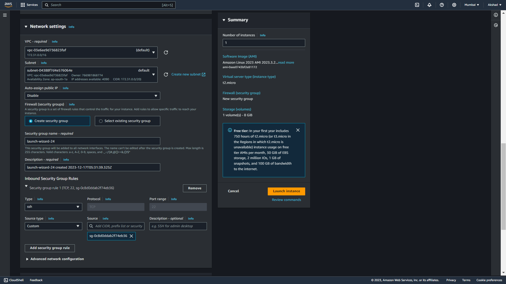
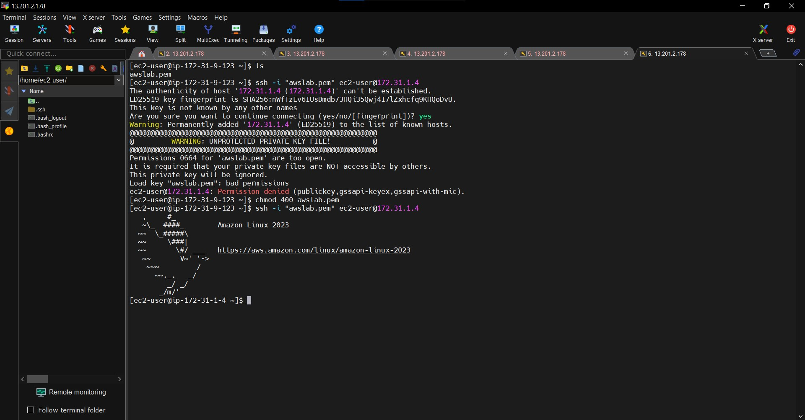

# AWS Console

### Connect Private Instance to Public Instance with Bastion Host


- How to connect with private Instance there have no public Ip , So help with Bastion host we connect the Instance with the help of another public instance to it.
- Best Practice we use private Instance configure with only public instance security group , So no every where will connect to it.

### Deployment Enviroment 

- [EC2](https://aws.amazon.com/pm/ec2)
- [Security Groups](https://docs.aws.amazon.com/vpc/latest/userguide/vpc-security-groups.html)
- [S3](https://aws.amazon.com/pm/serv-s3)
- [Putty / MobaXterm](https://mobaxterm.mobatek.net/)


### Steps to host a website in EC2 instance:

- Login into AWS Cloud Account :
- Launch First Public Instance :
- Launch Private Instance and in network setting and attach the public ip security Group to it :


- Connect With Public Ip In MobaXterm :
- In Your local System where a private Instance pem/ppk file is present open there terminal and change the public ip 

```bash
$ scp -i <Public IP key file name> <Private IP key file name> ec2-user@<IP public Instance>:/home/ec2-user
```

- The Private Instance pem file will be present in public Instnace 

- The file have not not permission so its provide read permission :
```bash
$ chmod 400 awslab.pem
```

- Connect to public ec2 to private ec2
```bash
$ ssh -i "<path of pem file>" ec2-user@<Private IP>
```

- Finally we connect with private Instance